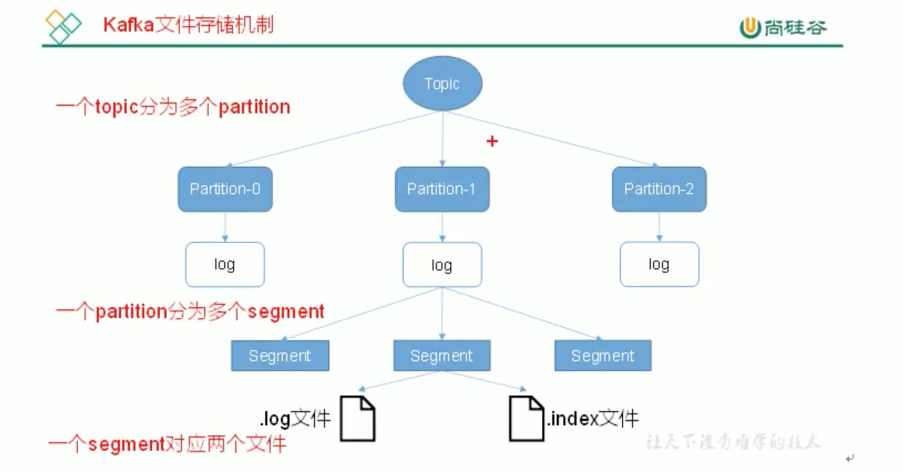
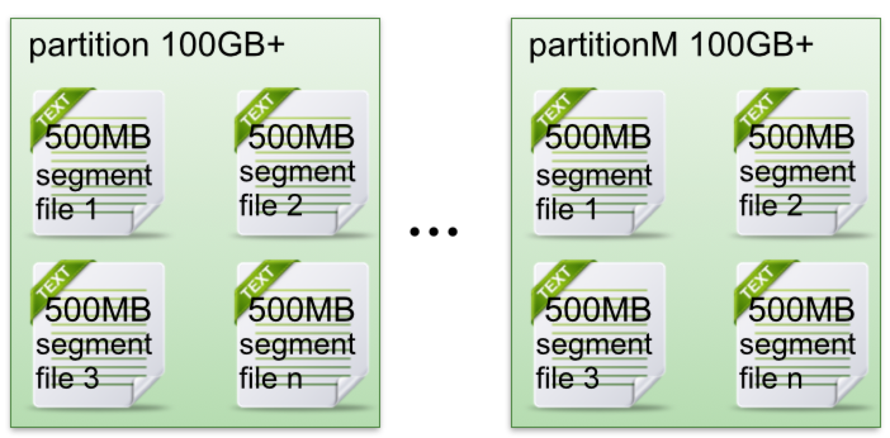
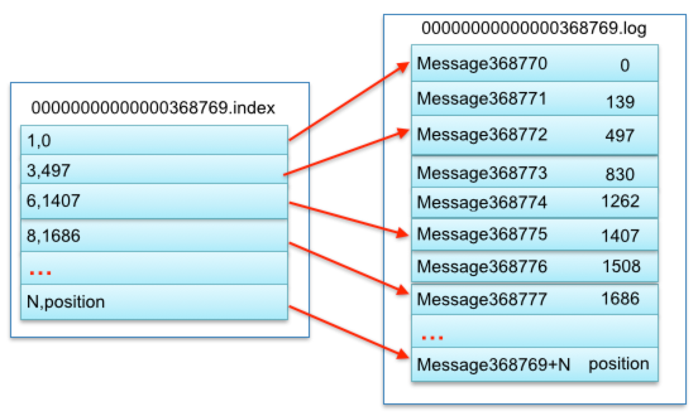

# 1. kafka 文件存储机制



## 1.1 topic中partition存储分布


`注意`: topic是物理上的逻辑概念，没有文件夹。


kafka的生产者生产消息 和 消费者消费消息 面对的对象都是 topic，每个topic可以有多个 **分区** 和 **副本**。

在Kafka文件存储中，同一个topic下有多个不同partition，每个partition为一个目录。

partition命名规则: topic名称+有序序号，第一个partition序号从0开始，序号最大值为partitions数量减1。
 
如果是多broker 下 partition 分布情况，请参考kafka集群partition分布原理分析。


### topic的相关配置

* 默认每个topic分区数: num.partitions

每个topic的分区个数，更多的partition会产生更多的segment file
```
num.partitions=2
```

* 是否允许自动创建topic: auto.create.topics.enable

是否允许自动创建topic ，若是false，就需要通过命令创建topic
```
auto.create.topics.enable =true
```

* 默认分区副本数: default.replication.factor

一个topic ，默认分区的replication个数 ，不能大于集群中broker的个数。

```
default.replication.factor =1
```


## 1.2 partition中文件存储方式



* 每个 partition(目录) 相当于一个巨型文件被平均分配到多个大小相等segment(段)数据文件中。但每个段segment file消息数量不一定相等，这种特性方便old segment file快速被删除。

* 每个 partition 只需要支持顺序读写就行了，segment文件生命周期由服务端配置参数决定。

### partition 配置

Partition是物理上的概念，Partition文件的目录在 server.properties 中配置:

`注意`: 一般默认为 logs，但是最好将其和logs文件分开，做到数据和日志分离。

```
# server.properties文件中
log.dirs=kafka安装目录/data

# 多个地址的话用逗号分割
log.dirs=kafka安装目录/kafka-logs-1，kafka安装目录/kafka-logs-2
```


## 1.3 partition中segment文件存储结构


* segment file组成：由2大部分组成，分别为 index file 和 data file ，此2个文件一一对应，成对出现，后缀”.index”和“.log”分别表示为segment索引文件、数据文件.

* segment文件命名规则：partition全局的第一个segment从0开始，后续每个segment文件名为上一个segment文件最后一条消息的offset值。数值最大为64位long大小，19位数字字符长度，没有数字用0填充。

由于生产者生产的消息会不断追加到 log 文件末尾，且每条数据都有自己的offset。

为防止 log文件过大导致数据定位效率低下，kafka采取了 **分片** 和 **索引**机制，将每个 partition 分为多个 segment。

> .timeindex文件。（0.8版本之前的kafka没有timeindex文件）, 是kafka的具体时间日志


### index 和 log文件关系



上述图中索引文件存储大量元数据，数据文件存储大量消息，索引文件中元数据指向对应数据文件中message的物理偏移地址。
 
其中以索引文件中元数据3,497为例，依次在数据文件中表示第3个message(在全局partiton表示第368772个message)、以及该消息的物理偏移地址为497。

### segment 配置

Partition文件的目录在 server.properties 中配置:

* 文件大小: log.segment.bytes

Segment File默认大小为 1G，每满500兆就会创建新的segment段。-1表示没有限制。

设置参数如下:

```
# server.properties文件中

# The maximum size of a log segment file. When this size is reached a new log segment will be created.
log.segment.bytes=1073741824
```

* 保存最长时间: log.retention.hours

Segment File默认保存最长时间为 7天，超过7天会被清理 log文件和index文件:

设置参数如下:

```
# server.properties文件中

# The minimum age of a log file to be eligible for deletion due to age
log.retention.hours=168
```

* 超过时间新建segment: log.roll.hours

当达到下面时间，会强制新建一个segment:

```
log.roll.hours = 24*7
```


## 1.4 在partition中如何通过offset查找message

例如读取offset=368776的message，需要通过下面2个步骤查找。

* 第一步查找segment file

其中00000000000000000000.index表示最开始的文件，起始偏移量(offset)为0.第二个文件00000000000000368769.index的消息量起始偏移量为368770 = 368769 + 1.同样，第三个文件00000000000000737337.index的起始偏移量为737338=737337 + 1，其他后续文件依次类推，以起始偏移量命名并排序这些文件，只要根据offset **二分查找**文件列表，就可以快速定位到具体文件。
 
 当offset=368776时定位到00000000000000368769.index|log

* 第二步通过segment file查找message

通过第一步定位到segment file，当offset=368776时，依次定位到00000000000000368769.index的元数据物理位置和00000000000000368769.log的物理偏移地址，然后再通过00000000000000368769.log顺序查找直到offset=368776为止。

从上述图3可知这样做的优点，segment index file采取稀疏索引存储方式，它减少索引文件大小，通过mmap可以直接内存操作，稀疏索引为数据文件的每个对应message设置一个元数据指针,它比稠密索引节省了更多的存储空间，但查找起来需要消耗更多的时间。

### 优点

优点: segment index file采取稀疏索引存储方式，它减少索引文件大小，通过mmap可以直接内存操作，稀疏索引为数据文件的每个对应message设置一个元数据指针,它比稠密索引节省了更多的存储空间，但查找起来需要消耗更多的时间。

