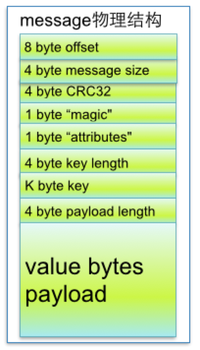

# 2. log文件中 message结构

segment data file 即 .index 文件 由许多message组成。

## 2.1 message 物理结构

下面详细说明message物理结构如下：

## 2.2 message 参数说明

| 关键字	| 解释说明 |
|---- |---- |
| 8 byte offset	| 在partition(分区)内的每条消息都有一个有序的id号，这个id号被称为偏移(offset),它可以唯一确定每条消息在partition(分区)内的位置。即offset表示partiion的第多少message |
| 4 byte message size | message大小 |
| 4 byte CRC32 | 用crc32校验message |
| 1 byte “magic” | 表示本次发布Kafka服务程序协议版本号 |
| 1 byte “attributes” | 表示为独立版本、或标识压缩类型、或编码类型 |
| 4 byte key length	| 表示key的长度,当key为-1时，K byte key字段不填 |
| K byte key | 可选 |
| value bytes payload | 表示实际消息数据 |
