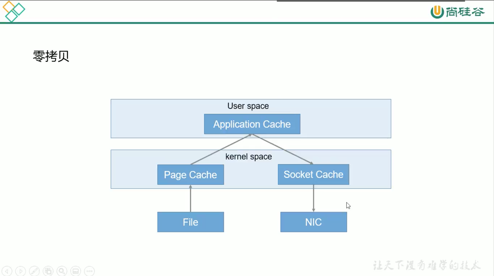
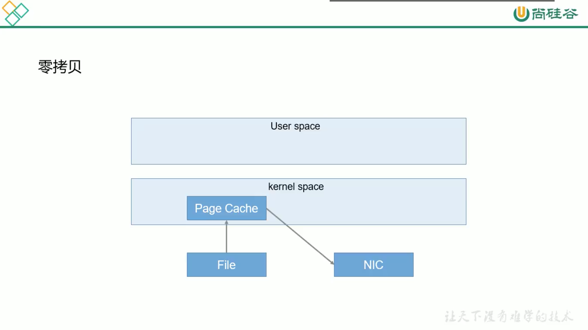

# 13. kafka高效读写

## 13.1 顺序写磁盘
kafka 的producer生产数据，要写入到log文件中，写的过程是一直追加到文件末端，为顺序写。

官网有数据表明，同样的磁盘，顺序写能到 600M/s，而随机写只有 100K/s。

这与磁盘的机械结构有关，顺序写之所以快，是因为其省去了大量磁头寻址时间。

## 13.2 0复制技术

文件正常读写:

0拷贝文件读写:

## 13.3 分布式技术

