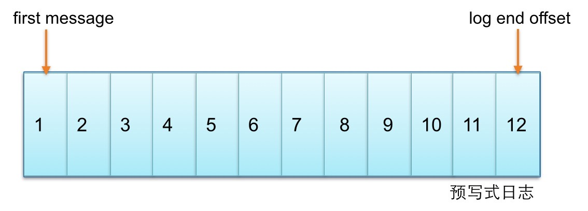
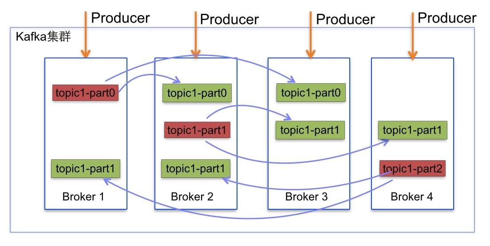
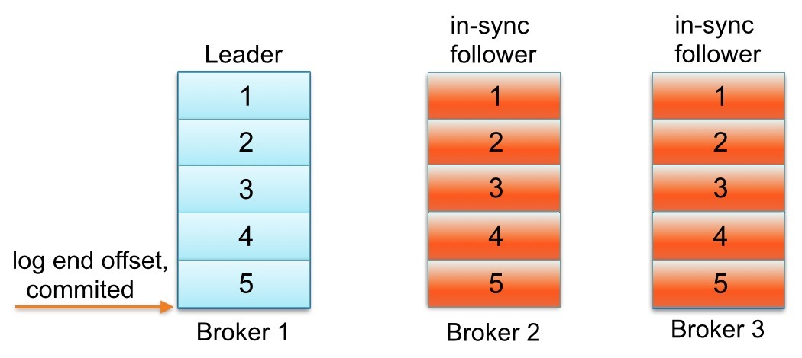
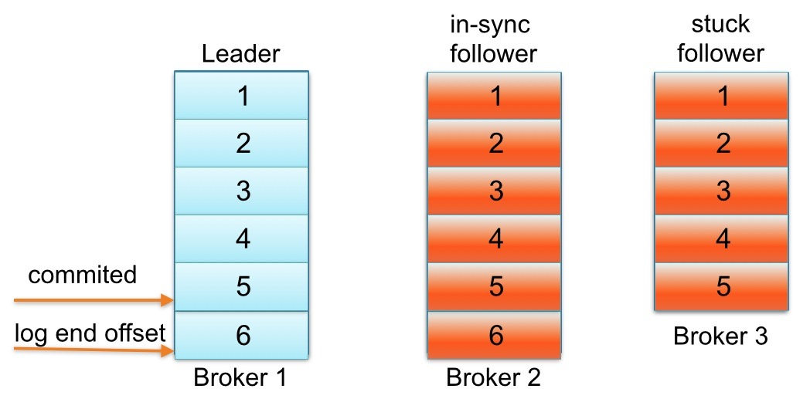
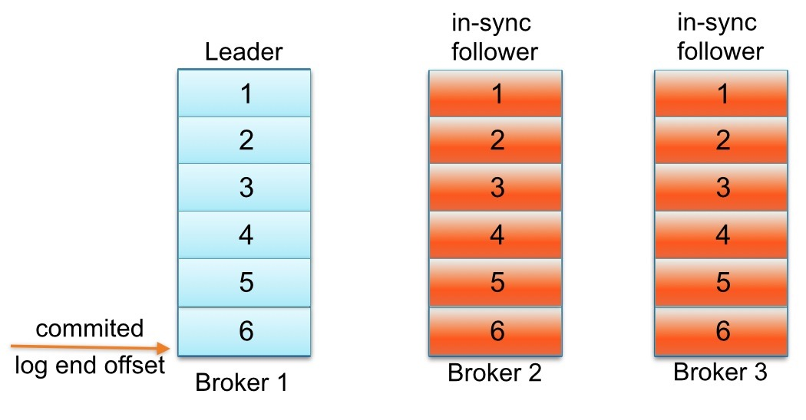
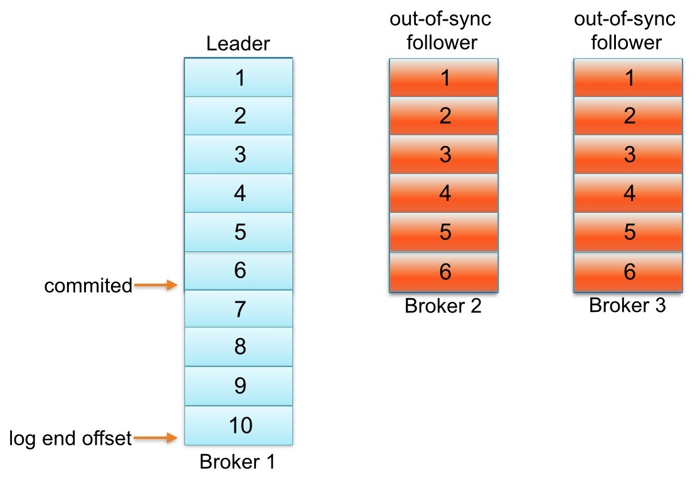
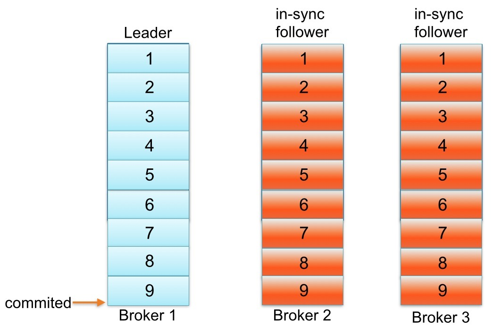

# 2. 生产者副本同步机制

1.Partition的多个replica中一个为Leader,其余为follower

2.Producer只与Leader交互,把数据写入到Leader中

3.Followers从Leader中拉取数据进行数据同步

4.Consumer只从Leader拉取数据

ISR:所有不落后的replica集合, 不落后有两层含义:

* 距离上次FetchRequest的时间不大于某一个值
* 落后的消息数不大于某一个值

Leader失败后会从ISR中选取一个Follower做Leader

## 2.1 Kafka 副本

Kafka中主题的每个 Partition 有一个 **预写式日志文件**，每个Partition都由一系列有序的、不可变的消息组成，这些消息被连续的追加到Partition中。

Partition中的每个消息都有一个连续的序列号叫做offset,确定它在分区日志中唯一的位置。

Kafka每个topic的partition有N个副本，其中 N 是topic的复制因子。

Kafka通过多副本机制实现故障自动转移，当Kafka集群中一个Broker失效情况下仍然保证服务可用。在Kafka中发生复制时确保 partition的预写式日志 有序地写到其他节点上。

N 个 replicas 中。其中一个 replica 为 leader，其他都为 follower，leader 处理 partition 的所有读写请求，与此同时，follower 会被动定期地去复制 leader 上的数据。

Kafka必须提供数据复制算法保证,如果leader发生故障或挂掉，一个新leader被选举并接收客户端的消息成功写入。

Kafka确保从同步副本列表(ISR)中选举一个副本为leader,或者换句话说,follower追赶leader数据。leader负责维护和跟踪ISR中所有follower滞后状态。

当生产者发送一条消息到Broker,leader写入消息并复制到所有follower。消息提交之后才被成功复制到所有的同步副本。消息复制延迟受最慢的follower限制,重要的是快速检测慢副本,如果follower”落后”太多或者失效,leader将会把它从replicas从ISR移除。

## 2.2 partition 的 follower 追上 leader 含义

Kafka中每个 partition 的 follower 没有“赶上” leader 的日志可能会从同步副本列表中移除。

### 案例

下面用一个例子解释一下“追赶”到底是什么意思。

请看一个例子：主题名称为foo 1 partition 3 replicas。
假设:
* replica.lag.max.messages: 4，表明只要 follower 落后 leader 不超过3，就不会从同步副本列表中移除。
* replica.lag.time.max: 500 ms，表明只要follower向leader发送请求时间间隔不超过500 ms，就不会被标记为死亡,也不会从同步副本列中移除。

假如 partition 的 replication 分布在 Brokers 1、2和3上，并且Broker 3消息已经成功提交。

同步副本列表中1为leader、2和3为follower。

下面看看，生产者发送下一条消息写入leader，与此同时follower Broker 3 GC暂停，如下图所示:

直到follower Broker 3从同步副本列表中移除或追赶上leader log end offset，最新的消息才会认为提交。

`注意`: 因为follower Broker 3小于replica.lag.max.messages= 4 落后于 leader Broker 1，Kafka不会从同步副本列表中移除。

在这种情况下,这意味着follower Broker 3需要迎头追赶上知道offset = 6,如果是,那么它完全“赶上” leader Broker 1 log end offset。

让我们假设代理3出来的GC暂停在100 ms和追赶上领袖的日志结束偏移量。

在这种状态下，下面partition日志会看起来像这样

## 2.3 是什么原因导致分区的副本与leader不同步?
一个副本可以不同步Leader有如下几个原因:

### 慢副本

在一定周期时间内follower不能追赶上leader。最常见的原因之一是 I/O 瓶颈导致follower追加复制消息速度慢于从leader拉取速度。

### 卡住副本

在一定周期时间内follower停止从leader拉取请求。follower replica卡住了是由于GC暂停或follower失效或死亡。

### 新启动副本

当用户给主题增加副本因子时，新的follower不在同步副本列表中，直到他们完全赶上了leader日志。

一个 partition 的 follower 落后于 leader 足够多时，被认为不在同步副本列表或处于滞后状态。

在Kafka-0.8.2.x中,副本滞后判断依据是副本落后于leader最大消息数量(replica.lag.max.messages)或replicas响应partition leader的最长等待时间(replica.lag.time.max.ms)。
* replica.lag.max.messages: 用来检测缓慢的副本
* replica.lag.time.max.ms: 用来检测失效或死亡的副本

## 2.4 如何确定副本是滞后的

这个模型检测不同步 卡住副本列表 工作下所有情况都适用。它追踪follower replica 时间内没有向 leader 发送拉取请求,表明它已经死了。

另一方面,如果均匀流量模式情况下，为一个主题或多个主题设置这些参数检测模型 不同步慢副本列表消息的数量 会工作很好,但我们发现生产环境中它不扩展到所有主题各种工作负载。

接着上面的例子,如果主题 foo 获取数据速率 2 msg/sec，leader 单次批量接收一般不会超过3条消息,然后你知道主题参数 replica.lag.max.messages 设置为4。为什么? 因为follower replica从leader复制消息前，已经有大批量消息写leader，follower replica落后于leader不超过3条消息 。

另一方面，如果主题foo的 follower replica 初始落后于 leader 持续超过3消息,leader 会从同步副本列表中移除慢副本，避免消息写延迟增加。

这本质上是replica.lag.max.messages的目标。能够检测follower与leader不一致且从同步副本列表移除。然而,主题在流量高峰期发送了一批消息(4条消息),等于replica.lag.max.messages = 4配置值。在那一瞬间,2个follower replica将被认为是”out-of-sync”并且leader会从同步副本列表中移除。

2个follower replica都是活着,下次拉取请求他们会赶上leader log end offset并重新加入同步副本列表。

重复相同的过程，如果生产者继续发送相对一批较大消息到leader。

这种情况演示了当follower replica频繁在从同步副本列表移除和重新加入同步副本列表之间来回切换时，不必要触发虚假警报。

参数replica.lag.max.messages指向核心问题。它的配置值根据队列流量大小和集群一般负载情况做出判断并设置一个合适值!

## 2.5 副本配置规则

笔者认为真正重要的事情是检测卡或慢副本,这段时间 follower replica 是 “out-of-sync” 落后于 leader。

在服务端现在只有一个参数需要配置 replica.lag.time.max.ms。

这个参数解释replicas响应 partition leader 的最长等待时间。

检测卡住或失败副本的探测: 如果一个 replica 失败导致发送拉取请求时间间隔超过replica.lag.time.max.ms。Kafka会认为此replica已经死亡会从同步副本列表从移除。

检测慢副本机制发生了变化: 如果一个 replica 开始落后 leader 超过 replica.lag.time.max.ms。Kafka会认为太缓慢并且会从同步副本列表中移除。除非 replica 请求 leader时间间隔大于replica.lag.time.max.ms，因此即使leader使流量激增和大批量写消息。Kafka也不会从同步副本列表从移除该副本。

