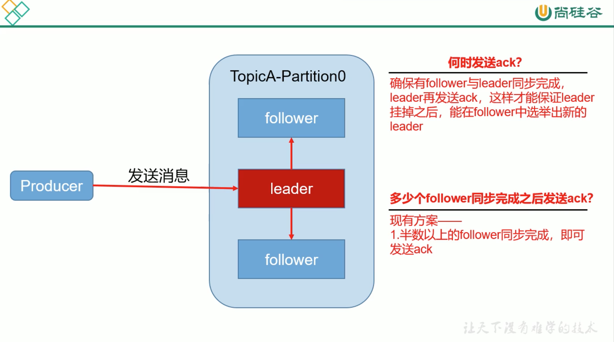

# 3. 副本同步策略

| 方案 | 优点 | 缺点 |
|----|----|----|
| 半数以上完成同步，就发送ack | 延迟低 | 选举新 leader 时，容忍 n 台节点的故障，需要 2n+1 个副本 |
| (kafka)全部完成同步，才发送ack | 选举新 leader时，容忍 n台节点的故障，需要 n+1 个副本 | 延迟高 |

**kafka选择了全部同步的原因**
* 1.同样为了容忍 n台节点的故障，第1种方案需要 2n+1个副本，第2种方案只需要 n+1个副本，而kafka的每个分区都有大量的数据，第1种方案会造成大量数据的冗余

* 2.虽然第2种方案的网络延迟会比较高，但网络延迟对kafka的影响较小
