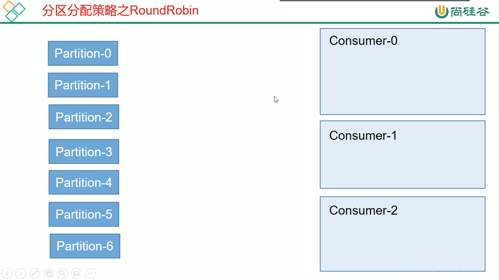
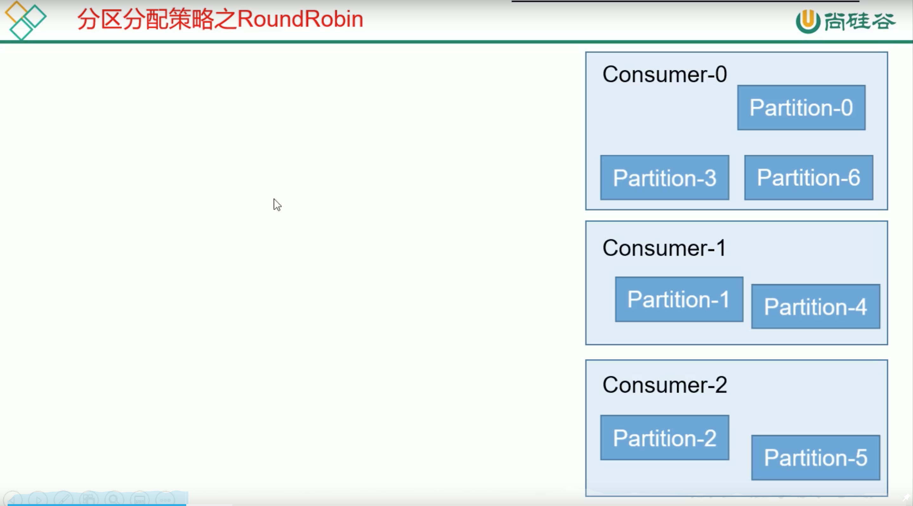
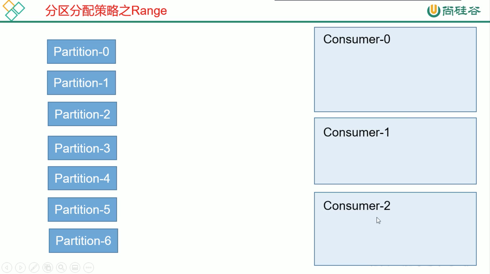
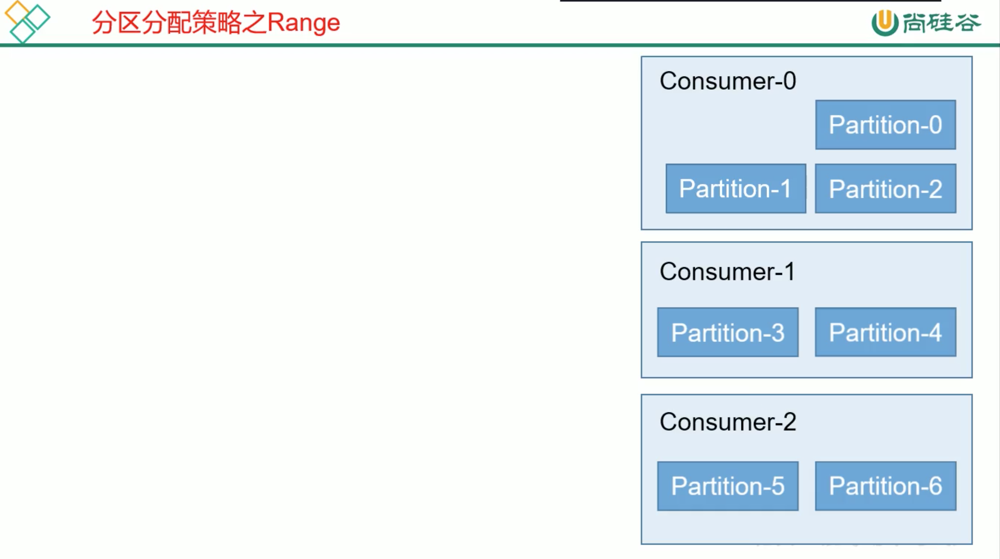

# 2. 消费者分区分配策略

1个 consumer group 中有多个 consumer，1个topic有多个 partition。

所以必然会涉及到 partition的分配问题: **确定哪个 partition 由哪个 consumer来消费**。


## 2.1 kafka 分配策略
kafka 有2种分配策略:
* Round-Robin: 面向消费者，轮询，保证消费者之间消息间隔差不超过1个。
* Range: 面向主题，保证消费者不会接收非订阅主题的消息。


## 2.2 Round-Robin策略

Round-Robin: 按照消费者组来划分。

将每个主题当做1个整体来看，每个主题有 TopicAndPartition类，然后根据每个主题的每个分区 TopicAndPartition类的 hash值进行排序，然后对每个主题的所有分区进行轮询。




`前提条件`: 每个消费者组中的每个消费者订阅的是同1个主题，否则会造成消费者消费非订阅主题的消息，错误严重。


## 2.3 Range策略

Range: 消费者组里每个消费者按照单个主题划分(kafka默认)，即每个消费者只能消费1个topic里的分区，不能跨topic。

如果1个topic给消费者组好几个消费者消费，则分配的策略:

```
topic分区个数 / 消费者个数 = 每个消费者平均分配的分区数...第1个消费者增加的分区数

其余的消费者都是 每个消费者平均分配的分区数
```

> 如 主题T1: 1 2 3 4 5 6 7 个分区，消费者组 C: C1 C2 C3
> 则:
>* C1 负责:  7 / 3 = 2...1，即 1 2 3 分区
>* C2 负责:  4 5 分区
>* C3 负责:  6 7 分区

缺点: 随着 单个 topic 的Partition增加，可能容易造成负载不均衡。





如果 T1 主题有3个分区，T2主题有5个分区，消费者组C: C1 C2，且 C1 C2都订阅了T1 和 T2，这种情况下，最好是采用轮询的策略，使得每个消费者能实现负载均衡。


## 2.4 重新分配

当消费者组中消费者个数发生改变(增多或减少时)时，就会发生重新分配。
