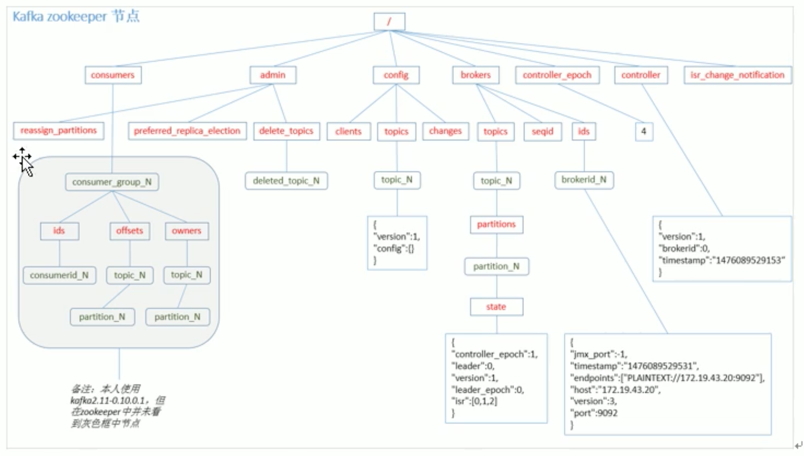

# 3. 消费者 offset存储

由于 consumer在消费过程中可能会出现断电、宕机等故障，consumer 恢复后，需要从故障前的位置继续消费，所以 consumer需要实时记录自己消费到了哪个offset，以便故障恢复后继续消费。


## 3.1 offset 存储方式
保存 offset: 消费者组(group)、主题(topic)、分区(partition)来一起保存的。


## 3.2 offset 设置
kafka 0.9 版本之前，consumer 默认将 offset保存在 Zookeeper中。

从 0.9版本开始，consumer默认将 offset保存在 kafka一个内置的topic中，该topic为 **__consumer__offsets**。

1.修改配置文件 consumer.propertise

设置普通消费者可以消费系统主题

```
exclude.internal.topics=false
```

2.读取offset

* 0.11版本之前

```
bin/kafka-console-consumer.sh --topic __consumer_offsets --zookeeper zk_host:zk_port --formatter "kafka.coordinator.GroupMetadataManager\$OffsetsMessageFormatter" --consumer.config config/consumer.properties --from-begining
```
* 0.11版本后
```
bin/kafka-console-consumer.sh --topic __consumer_offsets --bootstrap-server kafka_host:kafka_port --formatter "kafka.coordinator.group.GroupMetadataManager\$OffsetsMessageFormatter" --consumer.config config/consumer.properties --from-begining
```


