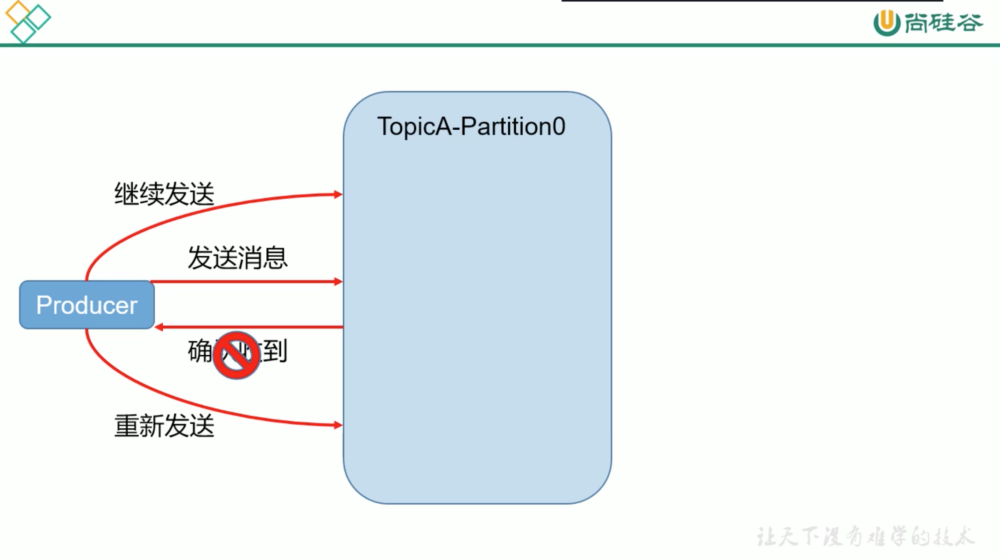

# 5. 生产者数据可靠性保证ISR

## 5.1 生产者发送消息

为保证 producer 发送的数据，能可靠的发送到指定的 topic:
* topic的每个partition收到 producer发送的数据后，都需要向 producer发送 ack
* 如果 producer收到ack，就会进行下一轮的发送，否则重新发送数据

## 5.2 副本数据同步策略

| 方案 | 优点 | 缺点 |
|----|----|----|
| 半数以上完成同步，就发送ack | 延迟低 | 选举新 leader 时，容忍 n 台节点的故障，需要 2n+1 个副本 |
| (kafka)全部完成同步，才发送ack | 选举新 leader时，容忍 n台节点的故障，需要 n+1 个副本 | 延迟高 |

### kafka选择了全部同步的原因

1.同样为了容忍 n台节点的故障，第1种方案需要 2n+1个副本，第2种方案只需要 n+1个副本，而kafka的每个分区都有大量的数据，第1种方案会造成大量数据的冗余

2.虽然第2种方案的网络延迟会比较高，但网络延迟对kafka的影响较小

## 5.3 ISR: 同步副本

采用方案2后，设想以下情景:

leader 收到数据后，所有 follower都开始同步，但有1个follower，因为某种故障，迟迟不能与 leader进行同步，那 leader就要一直等下去，直到它完成同步，才能发送 ack。

这种问题如何解决？

### ISR的概念

Leader维护了1个动态的 in-sync replica set(ISR)，意思是和 leader保持同步的 follower集合。

当ISR的follower完成数据的同步之后，leader就会给follower发送ack
* 如果 folower长时间未向 leader同步数据，则该 follower将被踢出ISR，该时间阀值由 replica.lag.time.max.ms 参数设定
* Leader发生故障时，会从ISR中选举新的 leader

旧版本: 还有数据丢失最大值 replica.lag.time.max.message 这个参数，从 kafka0.9 后移除了。

