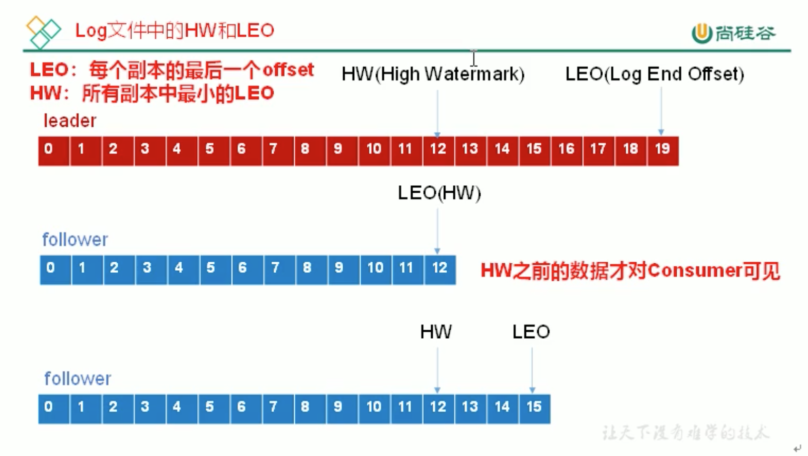

# 7. 数据一致性

## 7.1 LEO 和 HW

* LEO: 每个副本最大的offset

* HW: 高水位，消费者能见到的最大offset，保证消费者消费的一致性，ISR队列中最小的LEO

### follower 故障

follower 发生故障后会被临时踢出 ISR，待该 follower恢复后:
* follower 会读取本地磁盘记录上次的HW，并将 log文件高位HW的部分截取掉，从HW开始向leader同步
* 等待follower 的 LEO大于等于该 Partition的 HW，即follower 追上 leader后，就可以重新加入ISR了

### leader 故障

leader 发生故障后，会从 ISR中选出1个新的leader，之后，为保证多个副本之间数据一致性:
* 其余follower会先将各自的log文件高于 HW的部分截取掉
* 然后从新的leader同步数据

`注意`: 这只能保证副本之间的数据一致性，并不能保证数据不丢失或者不重复(数据丢失和重复和ack有关，hw无关)。
