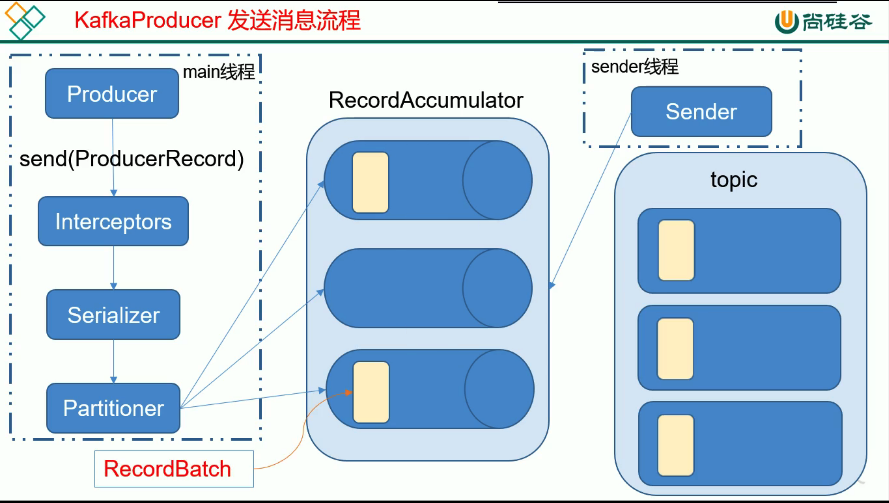

# 1. 消息发送流程

kafka 的Producer发送消息采用的是 **异步发送** 的方式。 

在发送消息过程中，涉及到了2个线程和1个线程共享变量，如下:
* **main线程**: 将消息发送给 RecordAccumulator
* **Sender线程**: 不断从 RecordAccumulator 拉取消息发送到 kafka broker
* **线程共享变量**: RecordAccumulator

> 123 456 789要由 Producer1 发送给 Topic1 的 Consumer1
> 
>`误区`: 以为 123 发送成功后获得 ack后，再发送 456，获得 ack确认后，再发送 789
>
> `实际`: 123  456 789 是123发送完后紧接着 456 ，紧接着 789

## 2. 相关参数
* batch.size: 只有数据累积到 batch.size之后，sender才会发送数据
* linger.ms: 如果数据迟迟未到 batch.size，sender等待 linger.time之后会发送数据

