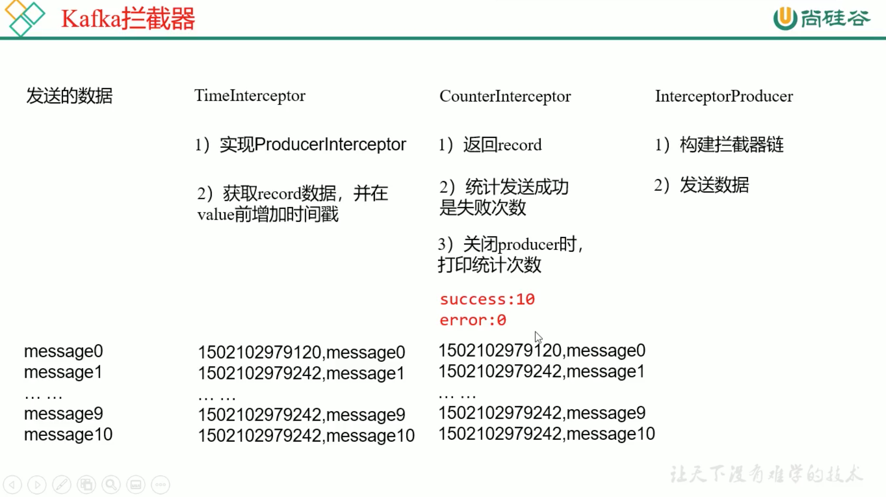

# 2. 拦截器案例

## 2.1 需求
实现1个简单的双 interceptor组成的拦截链。
* 第1个 interceptor会在消息发送前将 时间戳信息 加到 value的最前部
* 第2个 interceptor会在消息发送后 更新 成功发送消息数 或 失败发送消息数

如下:



## 2.2 java 实现拦截器案例

TimeInterceptor类实现如下:

```java
package com.atguigu.interceptor

public class TimeInterceptor implements ProducerInterceptor {
    @override
    public void configure(Map<String, ?> configs){
        
    }
    
    @override
    public ProducerRecord<String, String> onSend(ProducerRecord<String, String> record){
        //1.取出value数据
        String value = record.value();
        //2.创建建新的 ProducerRecord，并返回
        //因为不能对value赋值，没有set方法
        return new ProducerRecord<String, String>(record.topic(), record.partition(), record.key(), System.currentTimeMillions() + "," + value);
        
    }

    @override
    public void onAcknowledgement(RecordMetadata metadata, Exception exception){

    }
    @override
    public void close() {

    }
}
```

CounterInterceptor类实现如下:

```java
package com.atguigu.interceptor

public class CounterInterceptor implements ProducerInterceptor {
    int success;
    int error;

    @override
    public void configure(Map<String, ?> configs){
        
    }
    
    @override
    public ProducerRecord<String, String> onSend(ProducerRecord<String, String> record){
        return record;
    }

    @override
    public void onAcknowledgement(RecordMetadata metadata, Exception exception){
        if (metadata != null) {
            success++;
        }else {
            error++;
        }
    }
    @override
    public void close() {
        System.out.println("sucess: " + success);
        System.out.println("error: " + error);
    }
}
```

## 2.3 Python 实现拦截器案例
