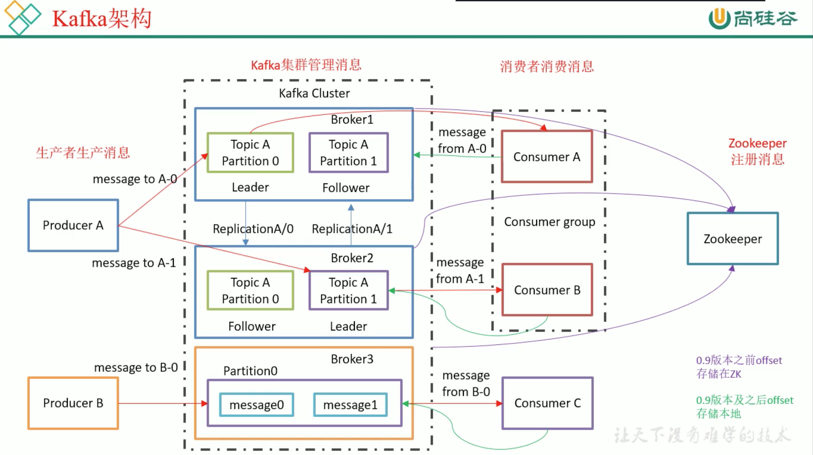

# 1. 生产环境kafka配置

## 1.1 kafka 架构

## 1.2 kafka 压测

kafka官方自带压力测试脚本: `kafka-consumer-perf-test.sh`、`kafka-producer-perf-test.sh`

kafka 压测时，可以查看到哪个地方出现了瓶颈(CPU、IO、内存网络)，一般都是网络IO达到瓶颈。

## 1.3 kafka 机器数量

kafka 机器数量 = 2 * (峰值产生速度 * 副本数 / 100 ) + 1

## 1.4 kafka 日志保存时间

7天

## 1.5 kafka 硬盘大小

每天数据量 * 7

## 1.6 kafka 监控

公司自己开发的监控器

## 1.7 kafka 分区数

## 1.8 副本数设定

## 1.9 多少个 topic

## 1.10 kafka 中数据量计算

每天数据量 100G，每天产生 1亿条日志，10000万/24/60/60=1150条/秒
* 平均每秒钟: 1150条
* 低谷每分钟: 400条
* 高峰每秒钟: 1150条 * (2~20)倍 = 2300~23000条
* 每条日志大小: 0.5k-2k
* 每秒多少数据量: 2.3M-20M
